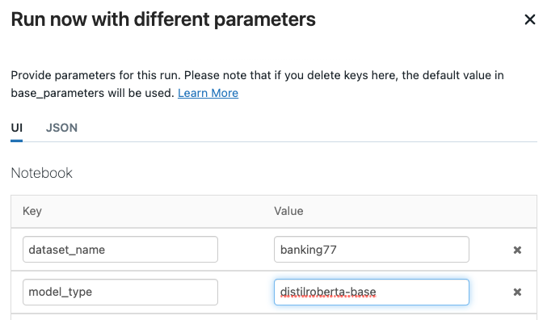
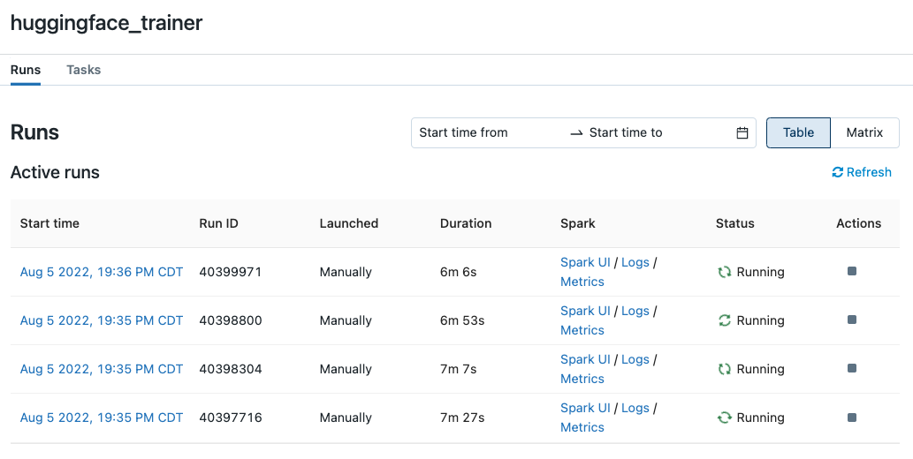
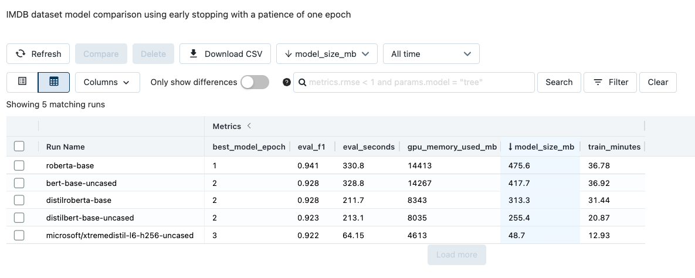
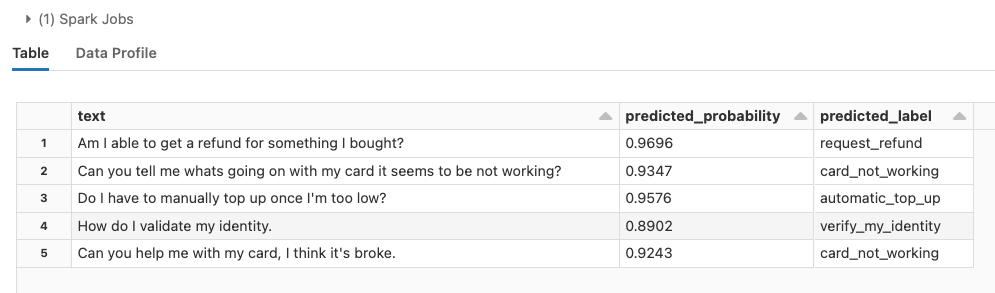

# Rapid NLP development with Databricks, Delta, and Transformers  
This Databricks [Repo](https://www.databricks.com/product/repos) provides example implementions of [huggingface transformer](https://huggingface.co/docs/transformers/index) models for text classification tasks. The project is self contained an can be easily run in your own Workspace. The project downloads several example datasets from huggingface and writes them to [Delta tables](https://docs.databricks.com/delta/index.html). The user can then choose from multiple transformer models to perform text classification. All model metrics and parameters are logged to [MLflow](https://docs.databricks.com/applications/mlflow/index.html). A separate notebook loads trained models promoted to the MLflow [Model Registry](https://docs.databricks.com/applications/mlflow/model-registry.html), performs inference, and writes results back to Delta.  

##### Datasets:
 - **[IMDB](https://huggingface.co/datasets/imdb)**: *binary classification*
 - **[Banking77](https://huggingface.co/datasets/banking77)**: *mutli-class classification*
 - **[Tweet Emotions](https://huggingface.co/datasets/sem_eval_2018_task_1)**: *multi-label classification*  
 
 Search for additional datasets in the [huggingface data hub](https://huggingface.co/datasets)
   
##### Models:
 - **[Distilbert](https://huggingface.co/docs/transformers/model_doc/distilbert)**
 - **[Bert](https://huggingface.co/docs/transformers/model_doc/bert)**
 - **[DistilRoberta](https://huggingface.co/distilroberta-base)**
 - **[Roberta](https://huggingface.co/roberta-base)**    
 - **[xtremedistil-l6-h256-uncased](https://huggingface.co/microsoft/xtremedistil-l6-h256-uncased)**  
 - **[xtremedistil-l6-h384-uncased](https://huggingface.co/microsoft/xtremedistil-l6-h384-uncased)**
 - **[xtremedistil-l12-h384-uncased](https://huggingface.co/microsoft/xtremedistil-l12-h384-uncased)**  
 
 Search for models suitable for a wide variety of tasks in the [huggingface model hub](https://huggingface.co/models)  
 
#### Getting started:  
To get started training these models in your own Workspace, simply follow the below steps. Note that both model training and inference are intended to be perfomed using single-node, GPU-backed clusters that leverage the Databricks ML runtime. The project was most recently tested using Databricks ML runtime 11.0 and a virtual machine type equiped with a single GPU. The transformers library will distributed model training across multiple GPUs if your virtual machine has more than one.
 1. Clone this github repository into a Databricks Repo  
 
 2. Open the **data** Notebook and attached the Notebook to a Cluster. Select "Run all" at the top of the notebook to download and store the example datasets as Delta tables. Review the cell outputs to see data samples and charts.
 
 3. Open the **train** Notebook. Notice that the notebook allows the user to choose a training dataset and model type. To get started, choose the banking77 datasets and the distilbert model. This dataset is relatively small and the distilbert model is among the faster transformer models to train. You can either run the notebook against an interactive cluster or as a [Job](https://docs.databricks.com/data-engineering/jobs/index.html). If excuting via a Job, you can pass parameters to overwrite the default dropdown widget values. Additionally, by increasing the Job's Maximum concurrent runs, you can fit multiple transformers models concurrently by launching several jobs with different values for model type.

    
    

    <i>Adjusting a Job's default parameters values to run different models against the same training dataset</i>
    
 

    
    

    <i>Training multiple transformers models in parallel using Databricks Jobs</i>
    

 
 4. The train notebook will create a new MLflow Experiment. You can navigate to this Experiment by clicking the hyperlink that appears under the cell containing the MLflow logging logic, or, by navigating to the Experiments pane and selecting the Experiment named,  **transformer_experiments**. Each row in the Experiment corresponds to a different trained transformer model. Click on an entry, review its parameters and metrics, run multiple models against a dataset and compare their performance.  
 
    
    

    <i>Comparing transformer model runs in MLflow; notice the wide variation in model size and time taken to score 1,000 records</i>
    

 5. To leverage a trained model for inference, copy the **Run ID** of a model located in its Experiment run. Paste the ID in the text box at the top of the **inference** notebook, or, run the inference notebook as a Job and paste the Run ID as a parameter. The inference job is also intended to be run on a GPU-backed single-node cluster. The notebook will generate predictions for both the training and testing sets used to fit the model; it will then write these results to a new Delta table.

    
    
    

    <i>Model predictions example for banking77 dataset</i>
    

    
