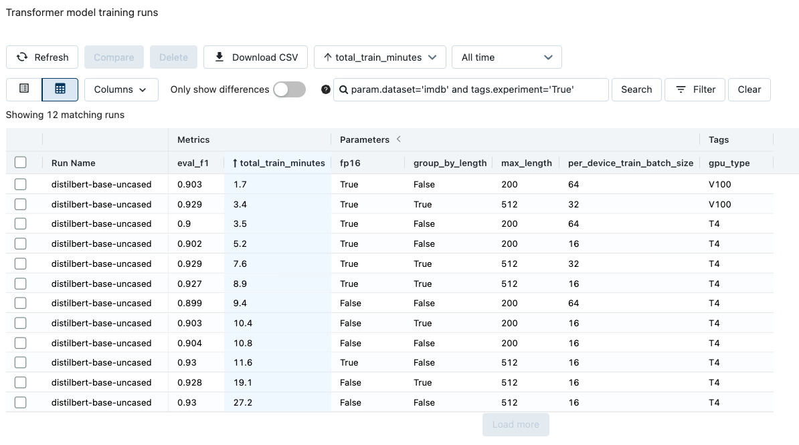

# Rapid NLP development with Databricks, Delta, and Transformers  
This Databricks Repo provides example implementations of [huggingface transformer](https://huggingface.co/docs/transformers/index) models for text classification tasks. The project is self contained and can be easily run in your own Workspace. The project downloads several example datasets from huggingface and writes them to [Delta tables](https://docs.databricks.com/delta/index.html). The user can then choose from multiple transformer models to perform text classification. All model metrics and parameters are logged to [MLflow](https://docs.databricks.com/applications/mlflow/index.html). A separate notebook loads trained models promoted to the MLflow [Model Registry](https://docs.databricks.com/applications/mlflow/model-registry.html), performs inference, and writes results back to Delta.

The Notebooks are designed to be run on a single-node, GPU-backed Cluster type. For AWS customers, consider the g5.4xlarge instance type. For Azure customers, consider the Standard_NC4as_T4_v3 instance type. The project was most recently tested using Databricks ML runtime 11.0. The transformers library will distribute model training across multiple GPUs if you choose a virtual machine type that has more than one.

##### Datasets:
 - **[IMDB](https://huggingface.co/datasets/imdb)**: *binary classification*
 - **[Banking77](https://huggingface.co/datasets/banking77)**: *mutli-class classification*
 - **[Tweet Emotions](https://huggingface.co/datasets/sem_eval_2018_task_1)**: *multi-label classification*  
 
 Search for additional datasets in the [huggingface data hub](https://huggingface.co/datasets)
   
##### Models:
 - **[Distilbert](https://huggingface.co/docs/transformers/model_doc/distilbert)**
 - **[Bert](https://huggingface.co/docs/transformers/model_doc/bert)**
 - **[DistilRoberta](https://huggingface.co/distilroberta-base)**
 - **[Roberta](https://huggingface.co/roberta-base)**    
 - **[xtremedistil-l6-h256-uncased](https://huggingface.co/microsoft/xtremedistil-l6-h256-uncased)**  
 - **[xtremedistil-l6-h384-uncased](https://huggingface.co/microsoft/xtremedistil-l6-h384-uncased)**
 - **[xtremedistil-l12-h384-uncased](https://huggingface.co/microsoft/xtremedistil-l12-h384-uncased)**  
 
 Search for models suitable for a wide variety of tasks in the [huggingface model hub](https://huggingface.co/models)  
 
#### Getting started:  
To get started training these models in your own Workspace, simply follow the below steps. 
 1. Clone this github repository into a Databricks Repo  
 
 2. Open the **data** Notebook and attached the Notebook to a Cluster. Select "Run all" at the top of the notebook to download and store the example datasets as Delta tables. Review the cell outputs to see data samples and charts.
 
 3. Open the **trainer** Notebook. Select "Run all" to train an initial model on the banking77 dataset. As part of the run, Widgets will appear at the top of the notebook enabling the user to choose different input datasets, models, and training parameters. To test different models and configurations, consider running the training notebook as a [Job](https://docs.databricks.com/data-engineering/jobs/index.html). When executing via a Job, you can pass parameters to overwrite the default widget values. Additionally, by increasing the Job's maximum concurrent runs, you can fit multiple transformer models concurrently by launching several jobs with different parameters.

    
    

    <i>Adjusting a Job's default parameters values to run different models against the same training dataset</i>
    
 

    
    

    <i>Training multiple transformers models in parallel using Databricks Jobs</i>
    

 
 4. The trainer notebook will create a new MLflow Experiment. You can navigate to this Experiment by clicking the hyperlink that appears under the cell containing the MLflow logging logic, or, by navigating to the Experiments pane and selecting the Experiment named,  **transformer_experiments**. Each row in the Experiment corresponds to a different trained transformer model. Click on an entry, review its parameters and metrics, run multiple models against a dataset and compare their performance.  
 
    
    

    <i>Comparing transformer model runs in MLflow; notice the wide variation in model size and time taken to score 1,000 records</i>
    

    
 5. To leverage a trained model for inference, copy the **Run ID** of a model located in an Experiment run. Run the first several cells of the **inference** notebook to generate the Widget text box and paste the Run ID into the text box. The notebook will generate predictions for both the training and testing sets used to fit the model; it will then write these results to a new Delta table.

    
    
    

    <i>Model predictions example for banking77 dataset</i>
    

    
 6. Experiment with different training configurations for a model as outlined in the [transformers documentation](https://huggingface.co/docs/transformers/performance). Training configuration and GPU type can lead to large differences in training times.
    
    

    <i>Training a single epoch using dynamic padding.</i>
    

    
